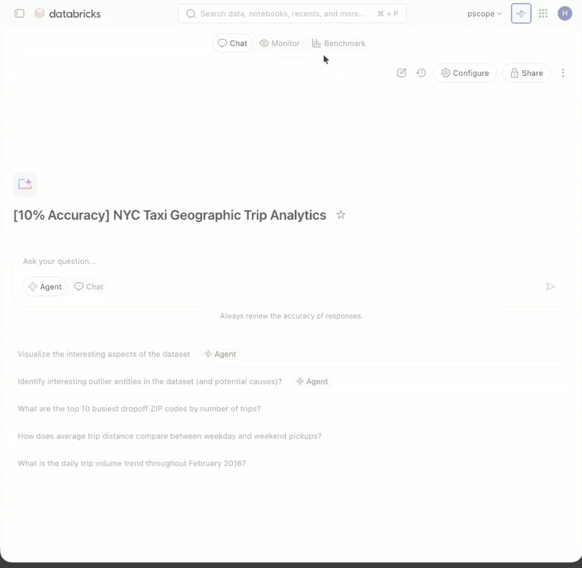

# MaxGenie

> [!IMPORTANT]
> **Archived project**
>
> MaxGenie is no longer actively maintained. Its validated optimizer ideas are
> being consolidated into
> [Genie Workbench](https://github.com/databricks-solutions/databricks-genie-workbench):
> observed-value grounding was merged in
> [PR #322](https://github.com/databricks-solutions/databricks-genie-workbench/pull/322),
> and production-traffic benchmark-gap discovery is proposed in
> [PR #323](https://github.com/databricks-solutions/databricks-genie-workbench/pull/323).
> Use Genie Workbench for active development and support. This repository
> remains available as historical reference.

<p align="center"><strong>Release v0.1.0</strong></p>

<p align="center">
  <a href="https://github.com/databricks-solutions/maxgenie/actions/workflows/tests.yml"></a>
</p>

<p align="center">
  
</p>

MaxGenie is a Databricks workspace skill for optimizing one Genie space at a time. It runs inside the Databricks workspace, creates a disposable optimization clone, reads the space benchmarks, proposes structured improvements through a Databricks serving endpoint, rejects regressions with benchmark gates, and writes a final report with checkpoints and rollback artifacts.

The source Genie space is never modified directly.

## Architecture

```mermaid
flowchart LR
  src["Source Genie space<br/>(read-only)"] --> clone["Export + managed clone<br/>(edits only here)"]
  clone --> assets["Editable assets"]

  clone --> bench{"Benchmarks?"}
  bench -- "No" --> adv["Advisory best-practices pass"] --> advReport["Not benchmark-verified<br/>no score"]

  bench -- "Yes" --> split["Train / validation / hidden holdout"]
  split --> base["Baseline eval"] --> cand["Candidate change<br/>visible evidence only"]
  assets --> cand

  cand --> gate["Train + validation gate"]
  gate --> pass{"Passes?"}
  pass -- "No" --> reject["Reject / restore"]
  pass -- "Yes" --> accept["Accept / checkpoint"]

  reject --> loop{"Budget left?"}
  accept --> loop
  loop -- "Yes" --> cand
  loop -- "No" --> audit["Final full eval<br/>hidden holdout included"]

  split -. "holdout not shown to candidates" .-> audit

  audit --> final{"Improves full score<br/>and holdout safe?"}
  final -- "Yes" --> promote["Promotable clone state"]
  final -- "No" --> safe["Safest checkpoint<br/>not promotable"]

  promote --> report["Final report"]
  safe --> report
```



The local `maxgenie` command is an operator wrapper for syncing the skill, launching Databricks jobs, checking status, and running the same workflow from a shell when needed. It is not the primary product surface.

## Promotion Evidence

The one promotable MaxGenie path is the clone-safe workspace skill or Databricks job flow with result-based comparison, a fresh canonical baseline, full benchmark coverage, hidden-holdout isolation, checkpointed rollback, and terminal selection that requires full-score improvement while blocking holdout regression.

Runs that use SQL-string comparison, partial benchmark coverage, observed-only baselines, or noncanonical splits are diagnostics. They can be useful for smoke tests and hypothesis generation, but final reports mark them non-comparable and they must be rerun under the strict result-based protocol before they count as leaderboard or release evidence.

## What It Does

- Parses a Genie space URL and validates Databricks authentication.
- Exports space configuration and benchmark questions.
- Creates or reuses a MaxGenie-managed optimization clone.
- Builds train, validation, and hidden holdout splits.
- Reuses the latest completed Genie benchmark run when requested, so the initial score does not need to be rerun on the source space.
- Applies safe metadata curation and benchmark-gated candidate changes.
- Uses a Databricks serving endpoint for strict JSON candidate proposals.
- Replays compatible prior accepted candidate sequences when local run memory is available.
- Repairs stale replay payloads so required pass-guard examples are preserved.
- Runs train and validation gates before accepting a candidate.
- Restores explicit recovery checkpoints if a clone needs to be recreated mid-run.
- Runs terminal selection so a final state is promoted only when full score improves and holdout does not regress.
- Runs one advisory best-practices pass when no benchmark exists, labels it not benchmark-verified, and never reports a fabricated score.
- Preserves checkpoints, iteration logs, candidate payloads, benchmark summaries, and owner-facing reports.

## Documentation

- [Operator reference](docs/operator-reference.md): local job submission, status checks, audit/replay jobs, and advanced flags.
- [Candidate modes](docs/candidate-modes.md): default strict artifact-patch behavior and controlled diagnostic modes.
- [Public release checklist](PUBLIC_RELEASE.md): publication scope, security checks, and review requirements.
- [Changelog](CHANGELOG.md): release notes.

## Public Release Guardrails

This repository is intended to contain only the reusable MaxGenie runtime, workspace skill files, templates, documentation, and tests. Do not publish generated workspace exports, benchmark payloads, query-history exports, local reports, transcripts, credentials, or customer data.

Examples and tests use synthetic fixture data. Any domain-specific product names, metric names, table names, and SQL snippets in tests are illustrative fixtures used to exercise optimizer behavior, not customer-provided data.

Before making a repository public, complete the checklist in `PUBLIC_RELEASE.md`, including license selection, third-party dependency license review, peer review, owner assignment, and confirmation that no non-public information is tracked.

## License

Copyright 2026 Databricks, Inc. All rights reserved. The source is provided subject to the Databricks License in `LICENSE.md`. Included or referenced third-party libraries are subject to their own licenses.

| library | description | license | source |
|---|---|---|---|
| `databricks-sdk` | Databricks SDK for Python | Apache-2.0 | <https://github.com/databricks/databricks-sdk-py> |
| `httpx` | HTTP client | BSD-3-Clause | <https://github.com/encode/httpx> |
| `pydantic` | Data validation | MIT | <https://github.com/pydantic/pydantic> |
| `PyYAML` | YAML parser/emitter | MIT | <https://pyyaml.org/> |
| `typer` | CLI framework | MIT | <https://github.com/fastapi/typer> |
| `python-dotenv` | Local env-file loading | BSD-3-Clause | <https://github.com/theskumar/python-dotenv> |
| `pytest` | Test runner | MIT | <https://github.com/pytest-dev/pytest> |
| `mlflow` | Optional tracking integration | Apache-2.0 | <https://github.com/mlflow/mlflow> |

## Primary Use: Databricks Workspace Skill

The workspace skill lives under `genie_skills/maxgenie`.

Sync it to a user-level skill path:

```bash
python genie_skills/maxgenie/scripts/sync_to_workspace.py \
  --profile <profile> \
  --host "https://<workspace>" \
  --destination "/Workspace/Users/<user>@<domain>/.assistant/skills/maxgenie"
```

Or sync it to a workspace-level skill path:

```bash
python genie_skills/maxgenie/scripts/sync_to_workspace.py \
  --profile <profile> \
  --host "https://<workspace>" \
  --destination "/Workspace/.assistant/skills/maxgenie"
```

After sync, open a Genie space and invoke the `MaxGenie` skill. In workspace authoring runtimes, use the in-process Python entrypoint because child shell processes may not inherit the runtime authentication context. Load the synced workspace runner explicitly; some Genie Code runtimes do not put the skill root on `sys.path`:

```python
import importlib.util
from pathlib import Path

from databricks.sdk import WorkspaceClient


def load_maxgenie_run_skill():
    user_name = WorkspaceClient().current_user.me().user_name
    candidate_paths = [
        Path(f"/Workspace/Users/{user_name}/.assistant/skills/maxgenie/scripts/runner.py"),
        Path("/Workspace/.assistant/skills/maxgenie/scripts/runner.py"),
    ]
    for runner_path in candidate_paths:
        if not runner_path.exists():
            continue
        spec = importlib.util.spec_from_file_location("maxgenie_skill_runner", runner_path)
        if spec is None or spec.loader is None:
            continue
        module = importlib.util.module_from_spec(spec)
        spec.loader.exec_module(module)
        return module.run_skill
    raise FileNotFoundError("Could not find the synced MaxGenie runner.")


run_skill = load_maxgenie_run_skill()

run_skill(
    mode="full",
    space_url="https://<workspace>/genie/rooms/<space_id>",
    strategy="serving",
    serving_endpoint="<candidate-serving-endpoint>",
    workspace_root="/Workspace/Users/<user>@<domain>/.maxgenie/runs/full",
    use_latest_observed_benchmark=True,
    plateau_rounds=4,
    warehouse_id="<sql-warehouse-id>",
)
```

If the run should create clones in a shared folder, pass `clone_parent_path="/Shared/<team-folder>"`. Otherwise MaxGenie creates clones under the Databricks run-as user's home folder.

## Multi-Hour Databricks Job Runs

For unattended optimization, submit the synced runner as a Databricks job. This is the recommended path for long runs because it is durable and does not depend on a foreground chat session:

```python
run_skill(
    mode="submit",
    space_url="https://<workspace>/genie/rooms/<space_id>",
    strategy="serving",
    serving_endpoint="<candidate-serving-endpoint>",
    workspace_root="/Workspace/Users/<user>@<domain>/.maxgenie/runs/job",
    use_latest_observed_benchmark=True,
    plateau_rounds=4,
    timeout_seconds=14400,
    warehouse_id="<sql-warehouse-id>",
)
```

`mode="submit"` is non-blocking by default from the programmatic workspace entrypoint. It prints the run id and canonical Jobs run page URL immediately; call `run_skill(mode="status", run_id="<run_id>", status_format="chat")` for later chat snapshots or final results. In a local shell, pass `wait=True` or use `maxgenie submit-run --wait` when you want the foreground process to poll and print streamed status updates.

The default job compute mode is serverless. If serverless jobs are unavailable, pass `compute_mode="existing_cluster"` plus `existing_cluster_id="<cluster-id>"`, or pass `compute_mode="new_cluster"` plus `new_cluster_json="<json-or-file>"`.

First-time users may need permissions for:

- reading the source Genie space and its benchmarks
- creating Genie spaces under the selected clone parent folder
- running the selected Databricks job compute mode
- calling the configured serving endpoint
- using a SQL warehouse for result-based comparison

Query-history enrichment may additionally need access to `system.query`. That signal is optional; MaxGenie reports the blocker instead of failing the run.

## Lite Smoke Test

Use lite mode only to verify that export, clone creation, a tiny benchmark subset, candidate evaluation, report writing, and optional clone cleanup work end to end:

```python
run_skill(
    mode="lite",
    space_url="https://<workspace>/genie/rooms/<space_id>",
    benchmark_limit=1,
    max_candidates=1,
    trash_clone=True,
)
```

Lite mode is not the optimizer; full or submit mode is the production path.

## Local Operator Setup

Local installation is useful for syncing the skill, submitting jobs, running status checks, and running the same workflow from a shell:

```bash
python3 -m venv .venv
source .venv/bin/activate
pip install -e '.[dev]'
```

MaxGenie resolves Databricks credentials in this order:

1. `--profile <profile>`
2. `DATABRICKS_CONFIG_PROFILE`
3. `DATABRICKS_HOST` plus `DATABRICKS_TOKEN`

When a space URL host is available and `--profile` is omitted, MaxGenie checks `~/.databrickscfg` and prefers a profile whose `host` matches the space URL.

Validate access:

```bash
maxgenie doctor --space-url "https://<workspace>/genie/rooms/<space_id>"
```

For repeated runs, set:

```bash
export MAXGENIE_DEFAULT_SPACE_URL="https://<workspace>/genie/rooms/<space_id>"
export MAXGENIE_SERVING_ENDPOINT="<candidate-serving-endpoint>"
```

## Local Full Run

```bash
maxgenie optimize \
  --space-url "https://<workspace>/genie/rooms/<space_id>" \
  --profile <profile> \
  --strategy serving \
  --serving-endpoint <candidate-serving-endpoint> \
  --use-latest-observed-benchmark \
  --plateau-rounds 4
```

`--strategy serving` asks the configured Databricks serving endpoint to return a strict JSON operation plan. MaxGenie applies only supported structured operations, pushes them to the clone, runs benchmark gates, rejects regressions, and checkpoints accepted states.

By default, serving optimization uses strict `artifact_patch_v2` candidates: compact, hash-checked edits grounded only in visible train/validation evidence. MaxGenie rejects malformed, over-broad, hidden-holdout-leaking, or guard-regressing patches before they can be accepted. Controlled candidate modes are available for diagnostics and advanced validation; see [Candidate modes](docs/candidate-modes.md).

Use `--warehouse-id <warehouse_id>` when result-based comparison should execute generated SQL and compare result sets. Without a usable warehouse, MaxGenie falls back to SQL-string comparison and records that in the report as diagnostic, non-comparable evidence. When generated SQL is missing or a result-based comparison attempt fails for an individual question, MaxGenie scores that question as a failed result-based comparison instead of falling back to SQL-string similarity or dropping it from coverage.

Useful flags:

- `--bootstrap-only`: export, clone, split, and score the baseline without candidate generation.
- `--use-latest-observed-benchmark`: seed the baseline from the latest completed Genie benchmark eval run.
- `--fresh-lineage`: start a new MaxGenie-managed clone lineage from the input space.
- `--clone-parent-path /Users/<user>` or `/Shared/<team-folder>`: choose where optimization clones are created.
- `--plateau-rounds` and `--timeout-seconds`: control the unattended loop for normal serving runs. Omit `--max-iterations` and `--candidate-budget` unless a diagnostic lane intentionally needs a hard cap; plateau and the job timeout should normally determine when the lane stops.
- `--serving-reasoning-effort none|low|medium|high|xhigh`: raise proposer reasoning effort (default `low`). Example: `--serving-reasoning-effort xhigh`; endpoints that do not support `xhigh` cap at `high`.
- `--audit-checkpoint-path <path>`: restore a checkpoint into the clone and run a final audit without candidate generation.
- `--audit-patch-path <path>`: replay an artifact patch sequence into the clone and run a final audit without candidate generation.

## Local Job Submission

The same job run can be submitted from a local shell:

```bash
maxgenie submit-run \
  --space-url "https://<workspace>/genie/rooms/<space_id>" \
  --profile <profile> \
  --strategy serving \
  --serving-endpoint <candidate-serving-endpoint> \
  --workspace-root "/Workspace/Users/<user>@<domain>/.maxgenie/runs/job" \
  --use-latest-observed-benchmark \
  --max-iterations 50 \
  --plateau-rounds 4 \
  --timeout-seconds 14400
```

Job submission requires the production-comparable protocol by default. Runs must provide a SQL warehouse for
result-based comparison and use a fresh baseline unless they are explicitly exploratory. To submit a diagnostic
run that should not be treated as promotion evidence, pass `--allow-diagnostic`.

The default job compute mode is serverless. If serverless jobs are unavailable, use `--compute-mode existing_cluster --existing-cluster-id <cluster-id>` or `--compute-mode new_cluster --new-cluster-json '<json-or-file>'`.

First-time users may need permissions for:

- reading the source Genie space and its benchmarks
- creating Genie spaces under the selected clone parent folder
- running the selected Databricks job compute mode
- calling the configured serving endpoint
- using a SQL warehouse for result-based comparison

Query-history enrichment may additionally need access to `system.query`. That signal is optional; MaxGenie reports the blocker instead of failing the run.

Useful job commands:

```bash
maxgenie submit-run ... --dry-run
maxgenie run-status <run_id> --space-url "https://<workspace>/genie/rooms/<space_id>"
maxgenie cancel-run <run_id> --space-url "https://<workspace>/genie/rooms/<space_id>"
```

Advanced audit, replay, compute, and diagnostic-mode submission examples are covered in the [Operator reference](docs/operator-reference.md).

## Artifact Layout

By default, local runs write under `workspace/<space_id>/` and workspace jobs write under the `--workspace-root` path.

```text
workspace/<space_id>/
  space/
    meta.yml
    tables/
    instructions/
    sample_questions.yml
  benchmarks/
    train_set.json
    validation_set.json
    validation_folds.json
    test_set.json
    split_meta.json
  results/
    baseline_train.json
    latest_train.json
    latest_validation_summary.json
    latest_test_score.txt
    latest_full_summary.json
    observed_benchmark_seed.json
    optimization_summary.json
    terminal_selection.json
    generalization_audit.json
    trace_memory.json
    failure_context_pack.json
    cross_run_memory.json
    query_history_summary.json
    query_history_recommendations.json
  history/
    iteration_log.jsonl
    train_runs/
    validation_runs/
    test_runs/
    full_runs/
    serving_candidates/
    recovery_checkpoints/
  checkpoints/
  clone_meta.json
  workspace_meta.json
  OPTIMIZATION_TASK.md
  final_report.md
```

The final holdout is used for audit and reporting, not for candidate proposal generation.

## Manual Commands

After bootstrap, run these from any directory by passing `--workspace-root` and `--space-id`, or from `workspace/<space_id>/` with defaults:

```bash
maxgenie push
maxgenie benchmark --train
maxgenie benchmark --validation
maxgenie benchmark --test
maxgenie benchmark --full
maxgenie query-history --warehouse-id <warehouse_id>
maxgenie status
maxgenie report
```

`maxgenie curate-loop` runs a conservative metadata curation sweep. Each curation mode is pushed and benchmarked independently, and a mode is accepted only when the benchmark gate does not regress.

## Operating Rules

- Never modify the source Genie space directly.
- Create optimization clones under the run-as user's home folder by default.
- Preserve run artifacts, checkpoints, and iteration logs.
- Accept a candidate only when benchmark gates do not regress.
- Keep hidden holdout content out of candidate proposal context.
- Report authentication, permission, package, endpoint, and warehouse blockers explicitly.
